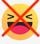

## What is this?

This is a chrome browser extension you can install to hide the "laughing" emoji reaction from facebook.

## Why?

Because almost everyone who uses this emoji uses it to signify mockery, not to appreciate jokes. It's the default tool people use in the absence of a "dislike" button. It is most often affixed to opinions you disagree with, to indicate "I'm laughing at you because you are stupid and I want you to feel small." I'm sure if there was a "respectfully disagree" reaction, people would use that, but there isn't, so people use this as a sort of "rudely disagree" button. It makes facebook a much less pleasant place.

## Does it work?

Mostly. There are a few edge cases I don't handle, but the main cases (reactions to posts and comments in the main feed) are handled pretty reliably. If you spot a case where I missed one, feel free to open a bug report or send a pull request, I'd like to improve this over time.

## Installation

[Download this repository as a zip file](https://github.com/MKorostoff/unmocker/archive/master.zip) and then load it as an [unpacked extension](https://webkul.com/blog/how-to-install-the-unpacked-extension-in-chrome/). Eventually I'll get it added to the chrome store.
